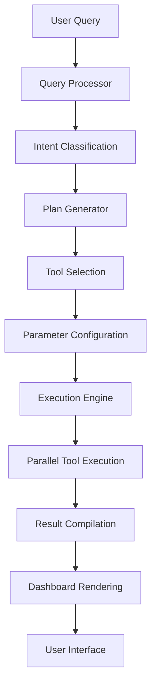
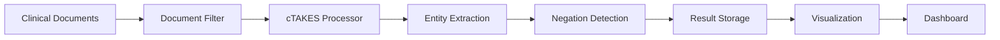

# cAIdence Architecture Guide

This document provides a comprehensive overview of cAIdence's architecture, design principles, and implementation details.

## 🏗️ System Overview

cAIdence is built as a modular, extensible platform that democratizes clinical NLP through an agentic AI approach. The system transforms complex clinical text analysis into conversational interactions.

### High-Level Architecture

```
┌─────────────────────────────────────────────────────────────────┐
│                        User Interface Layer                     │
├─────────────────────────────────────────────────────────────────┤
│  Web Interface  │    API Gateway   │   Authentication  │  Admin │
│   (Streamlit)   │   (FastAPI)      │     (OAuth2)      │  Panel │
└─────────────────┴──────────────────┴───────────────────┴────────┘
                                │
┌─────────────────────────────────────────────────────────────────┐
│                      Application Layer                          │
├─────────────────────────────────────────────────────────────────┤
│        Agent Core       │      Tool Registry     │   Dashboard   │
│      (LangChain)        │    (Plugin System)     │   (Plotly)    │
│                         │                        │               │
│  ┌─────────────────┐   │  ┌─────────────────┐   │ ┌───────────┐ │
│  │ Query Processor │   │  │   cTAKES Tool   │   │ │ Visualizer│ │
│  │ Plan Generator  │   │  │ Document Filter │   │ │ Exporter  │ │
│  │ Executor        │   │  │ Negation Detect │   │ │ Dashboard │ │
│  │ Result Compiler │   │  │ Summarizer      │   │ │ Manager   │ │
│  └─────────────────┘   │  └─────────────────┘   │ └───────────┘ │
└─────────────────────────────────────────────────────────────────┘
                                │
┌─────────────────────────────────────────────────────────────────┐
│                       Data Layer                                │
├─────────────────────────────────────────────────────────────────┤
│   PostgreSQL    │     Redis      │   File Storage   │    LLM    │
│   (Clinical     │    (Cache)     │   (Documents)    │ (Ollama)  │
│    Database)    │                │                  │           │
└─────────────────┴────────────────┴──────────────────┴───────────┘
                                │
┌─────────────────────────────────────────────────────────────────┐
│                    Infrastructure Layer                         │
├─────────────────────────────────────────────────────────────────┤
│     Docker      │   Kubernetes   │    Monitoring    │  Security │
│   (Containers)  │  (Orchestration)│   (Logging)     │   (Vault) │
└─────────────────┴────────────────┴──────────────────┴───────────┘
```

## 🧠 Core Components

### 1. Agent Core (`caidence.agent`)

The heart of cAIdence, implementing the agentic AI approach to clinical text analysis.

#### Query Understanding
```python
class QueryProcessor:
    """Processes natural language queries into structured analysis plans."""
    
    def understand_query(self, query: str) -> QueryIntent:
        """
        Extract intent, entities, constraints, and context from user query.
        
        Example:
        Query: "Find surgical notes mentioning arterial graft but not infection"
        
        Returns:
        QueryIntent(
            action="search_documents",
            document_types=["surgical notes"],
            required_entities=["arterial graft"],
            excluded_entities=["infection"],
            time_constraints=None,
            output_format="summary"
        )
        """
```

#### Plan Generation
```python
class PlanGenerator:
    """Creates executable plans from query intents."""
    
    def create_plan(self, intent: QueryIntent) -> ExecutionPlan:
        """
        Generate step-by-step execution plan with tool selection,
        parameter configuration, and dependency management.
        """
```

#### Execution Engine
```python
class ExecutionEngine:
    """Orchestrates plan execution across multiple tools."""
    
    async def execute_plan(self, plan: ExecutionPlan) -> AnalysisResult:
        """
        Execute plan steps in parallel where possible,
        handle errors gracefully, and compile results.
        """
```

### 2. Tool System (`caidence.tools`)

Extensible plugin architecture for clinical NLP capabilities.

#### Base Tool Interface
```python
class BaseTool(ABC):
    """Abstract base class for all cAIdence tools."""
    
    @abstractmethod
    def initialize(self) -> bool:
        """Initialize tool resources and validate configuration."""
    
    @abstractmethod
    def execute(self, parameters: Dict[str, Any]) -> ToolResult:
        """Execute tool with given parameters."""
    
    @abstractmethod
    def get_schema(self) -> Dict[str, Any]:
        """Return JSON schema for tool parameters."""
```

#### Available Tools

1. **cTAKES Processor** (`ctakes.py`)
   - Clinical entity extraction
   - UMLS concept mapping
   - Configurable pipelines

2. **Document Filter** (`document_filter.py`)
   - Multi-criteria filtering
   - Date range queries
   - Content-based search

3. **Negation Detector** (`negation_detector.py`)
   - Clinical negation patterns
   - Scope detection
   - Context analysis

4. **Summarizer** (`summarizer.py`)
   - Multiple output formats
   - Statistical summaries
   - Key findings extraction

5. **Visualizer** (`visualizer.py`)
   - Interactive charts
   - Clinical dashboards
   - Export capabilities

### 3. Dashboard System (`caidence.dashboard`)

Comprehensive visualization and reporting framework.

#### Dashboard Manager
```python
class Dashboard:
    """Main dashboard for displaying analysis results."""
    
    def render_summary(self) -> Dict[str, Any]:
        """Generate high-level summary statistics."""
    
    def render_visualizations(self) -> List[Dict[str, Any]]:
        """Create interactive visualizations."""
    
    def export_results(self, format_type: str) -> Any:
        """Export results in various formats (PDF, Excel, JSON)."""
```

## 🔧 Design Principles

### 1. Modularity
- **Separation of Concerns**: Each component has a single responsibility
- **Loose Coupling**: Components interact through well-defined interfaces
- **High Cohesion**: Related functionality is grouped together

### 2. Extensibility
- **Plugin Architecture**: New tools can be added without core changes
- **Configuration-Driven**: Behavior controlled through configuration files
- **Event-Driven**: Components communicate through events and callbacks

### 3. Security
- **Privacy by Design**: PHI protection built into every component
- **Principle of Least Privilege**: Minimal required permissions
- **Defense in Depth**: Multiple security layers

### 4. Scalability
- **Horizontal Scaling**: Components can be distributed across machines
- **Asynchronous Processing**: Non-blocking I/O for better performance
- **Caching Strategy**: Multiple cache layers for optimization

### 5. Reliability
- **Graceful Degradation**: System continues operating with reduced functionality
- **Error Recovery**: Automatic retry mechanisms and fallback strategies
- **Health Monitoring**: Comprehensive logging and metrics

## 📊 Data Flow

### Query Processing Flow



### Document Processing Pipeline



## 🗄️ Data Models

### Core Entities

```python
@dataclass
class ClinicalDocument:
    """Represents a clinical document in the system."""
    id: str
    title: str
    document_type: str
    content: str
    metadata: Dict[str, Any]
    created_date: datetime
    processed_date: Optional[datetime] = None

@dataclass
class ExtractedEntity:
    """Represents an extracted clinical entity."""
    text: str
    entity_type: str
    begin_offset: int
    end_offset: int
    cui: Optional[str]  # UMLS Concept Unique Identifier
    tui: Optional[str]  # UMLS Type Unique Identifier
    confidence: float
    is_negated: bool = False

@dataclass
class AnalysisResult:
    """Complete results from a clinical analysis query."""
    query: str
    documents_processed: int
    entities_found: List[ExtractedEntity]
    summary: str
    visualizations: List[Dict[str, Any]]
    execution_time: float
    confidence: float
```

### Database Schema

```sql
-- Clinical documents storage
CREATE TABLE clinical_documents (
    id UUID PRIMARY KEY,
    document_id VARCHAR(255) UNIQUE,
    title VARCHAR(500),
    document_type VARCHAR(100),
    content TEXT,
    metadata JSONB,
    created_date TIMESTAMP,
    processed_date TIMESTAMP
);

-- Extracted entities with relationships
CREATE TABLE extracted_entities (
    id UUID PRIMARY KEY,
    document_id UUID REFERENCES clinical_documents(id),
    entity_text VARCHAR(500),
    entity_type VARCHAR(100),
    begin_offset INTEGER,
    end_offset INTEGER,
    cui VARCHAR(20),
    tui VARCHAR(20),
    confidence FLOAT,
    is_negated BOOLEAN
);

-- Analysis results and query history
CREATE TABLE analysis_results (
    id UUID PRIMARY KEY,
    query_text TEXT,
    execution_plan JSONB,
    results JSONB,
    execution_time FLOAT,
    confidence FLOAT,
    created_at TIMESTAMP
);
```

## 🔌 Integration Points

### External Systems

1. **Apache cTAKES**
   - Java subprocess execution
   - File-based I/O
   - Configuration management

2. **LLM Providers**
   - Ollama (local)
   - OpenAI API (optional)
   - Hugging Face models

3. **EHR Systems** (Future)
   - FHIR API integration
   - HL7 message processing
   - Real-time data feeds

### API Endpoints

```python
# RESTful API design (Future FastAPI implementation)
@app.post("/api/v1/analyze")
async def analyze_query(query: AnalysisRequest) -> AnalysisResponse:
    """Process a clinical text analysis query."""

@app.get("/api/v1/documents")
async def list_documents(filters: DocumentFilters) -> List[DocumentSummary]:
    """Retrieve filtered list of clinical documents."""

@app.post("/api/v1/documents")
async def upload_document(document: ClinicalDocument) -> DocumentResponse:
    """Upload a new clinical document."""
```

## 🚀 Performance Considerations

### Optimization Strategies

1. **Caching**
   - Redis for query results
   - In-memory tool results
   - Database query caching

2. **Parallel Processing**
   - Async tool execution
   - Multi-threaded document processing
   - Batch operations

3. **Resource Management**
   - Connection pooling
   - Memory optimization
   - Disk space management

### Scalability Patterns

1. **Horizontal Scaling**
   - Load balancer distribution
   - Database sharding
   - Microservice deployment

2. **Vertical Scaling**
   - Memory optimization
   - CPU-intensive operations
   - Storage optimization

## 🔒 Security Architecture

### Security Layers

1. **Application Security**
   - Input validation and sanitization
   - SQL injection prevention
   - XSS protection

2. **Data Security**
   - Encryption at rest
   - Encryption in transit
   - PHI tokenization

3. **Infrastructure Security**
   - Network segmentation
   - Access controls
   - Audit logging

### Privacy Protection

1. **PHI Handling**
   - Local processing only
   - No external API calls with PHI
   - Automatic de-identification

2. **Access Control**
   - Role-based permissions
   - Audit trails
   - Session management

## 🧪 Testing Strategy

### Test Pyramid

1. **Unit Tests** (Fast, Isolated)
   - Individual function testing
   - Mock external dependencies
   - 80%+ code coverage

2. **Integration Tests** (Medium Speed)
   - Component interactions
   - Database operations
   - Tool integrations

3. **End-to-End Tests** (Slow, Comprehensive)
   - Full workflow testing
   - User interface validation
   - Performance benchmarks

### Test Categories

```python
# Example test structure
tests/
├── unit/
│   ├── test_agent.py
│   ├── test_tools.py
│   └── test_dashboard.py
├── integration/
│   ├── test_database.py
│   ├── test_ctakes.py
│   └── test_api.py
└── e2e/
    ├── test_user_workflows.py
    └── test_performance.py
```

## 📈 Monitoring and Observability

### Metrics Collection

1. **Application Metrics**
   - Query response times
   - Tool execution times
   - Error rates

2. **Business Metrics**
   - User engagement
   - Query success rates
   - Document processing volume

3. **Infrastructure Metrics**
   - Resource utilization
   - Database performance
   - Network latency

### Logging Strategy

```python
# Structured logging with context
logger.info(
    "Query processed successfully",
    extra={
        "user_id": user.id,
        "query": query_text,
        "execution_time": execution_time,
        "documents_processed": doc_count,
        "entities_found": entity_count
    }
)
```

## 🔄 Development Workflow

### Git Workflow

1. **Feature Branches**: Develop features in isolation
2. **Pull Requests**: Code review and discussion
3. **Continuous Integration**: Automated testing and validation
4. **Release Branches**: Stable release preparation

### Code Quality

1. **Linting**: Black, flake8, mypy
2. **Type Hints**: Comprehensive type annotations
3. **Documentation**: Docstrings and examples
4. **Reviews**: Peer code review process

---

This architecture document serves as a living guide for understanding and contributing to cAIdence. For implementation details, see the source code and inline documentation.
